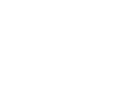

# Angles90

The Original Ergonomic Grips. Angles90 is patented with  
durable and reliable materials to leverage your motivation.  
https://angles90.com/

## Corporate Logo

### Horizontal

 
`angles90--hor.svg`,
multicolored,
for light backgrounds,
dimensions 776×100

 
`angles90--hor-light.svg`,
multicolored,
for dark backgrounds,
dimensions 776×100

 
`angles90--hor-black.svg`,
single-colored black,
dimensions 776×100

 
`angles90--hor-white.svg`,
single-colored white,
dimensions 776×100

### Vertical

 
`angles90--ver.svg`,
multicolored,
for light backgrounds,
dimensions 128×100

 
`angles90--ver-light.svg`,
multicolored,
for dark backgrounds,
dimensions 128×100

 
`angles90--ver--black.svg`,
single-colored black,
dimensions 128×100

 
`angles90--ver-white.svg`,
single-colored white,
dimensions 128×100
