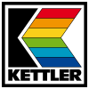

# Kettler

Since 2020, product development and sales strategies have been pursued 
separately for different product areas and global geographical regions 
under the leadership of various entrepreneurial families, all of whom 
have had close ties with the KETTLER family for decades, either as major 
customers or suppliers, and who also regard Heinz Kettler's principles 
of innovation, quality, and customer focus as their own principles in 
the further development of KETTLER's history.

- KETTLER About the Brand: https://www.kettler.de/
- KETTLER Sport and Fitness: https://kettlersport.com/
- KETTLER Table Tennis, Kettcar, Kids and Play: https://www.kettlershop.com/
- KETTLER Home and Garden: https://www.kettler-garden.com/

## Logo

 
`kettler.svg`,
multicolored,
dimensions 100×100

 
`kettler--transparent.svg`,
multicolored transparent,
dimensions 100×100

 
`kettler--black-and-white.svg`,
black color on white background,
dimensions 100×100

 
`kettler--black.svg`,
single-colored black,
dimensions 100×100

 
`kettler--black-inverted.svg`,
single-colored black,
dimensions 100×100

 
`kettler--white.svg`,
single-colored black,
dimensions 100×100

 
`kettler--white-inverted.svg`,
single-colored black,
dimensions 100×100

## Wordmark

 
`kettler--wordmark.svg`,
single-colored black,
dimensions 625×100

 
`kettler--wordmark-light.svg`,
single-colored white,
dimensions 625×100
