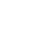

# Kinomap

Interactive indoor training: Ride, Run Row  
https://www.kinomap.com/

## Logo

### Horizontal

 
`kinomap--hor.svg`,
single-colored black,
dimensions 492×100

 
`kinomap--hor-light.svg`,
single-colored white,
dimensions 492×100

### Vertical

 
`kinomap--ver.svg`,
single-colored black,
dimensions 161×100

 
`kinomap--ver-light.svg`,
single-colored white,
dimensions 161×100

## Brandmark

 
`kinomap--brandmark.svg`,
multicolored,
dimensions 99×100

 
`kinomap--brandmark-black.svg`,
single-colored black,
dimensions 99×100

 
`kinomap--brandmark-white.svg`,
single-colored white,
dimensions 99×100

## App-Icon

 
`kinomap--app-icon.svg`,
multicolored,
dimensions 100×100

 
`kinomap--appicon-inverted.svg`,
multicolored inverted,
dimensions 100×100

 
`kinomap--appicon-black.svg`,
single-colored black,
dimensions 100×100

 
`kinomap--appicon-white.svg`,
single-colored white,
dimensions 100×100
