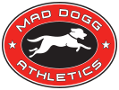
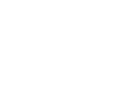

# Mad Dogg

Fitness Equipment and Education Company  
– https://www.maddogg.com/  
– https://www.spinning.eu/

**ATTENTION**
~~~
  SPIN®, SPINNER®, SPINNING®, SPINTV®, SPIN FITNESS®, SPINPower®,  
   SPIN PILATES®, SPIN® YOGA, THE SPINNING® LOGO, PEAK PILATES®,  
   CROSSCORE®, RESIST-A-BALL® AND UGI® ARE REGISTERED TRADEMARKS  
           THAT ARE OWNED BY MAD DOGG ATHLETICS, INC
~~~

## Logo

### Mad Dogg Athletics

 
`mad-dogg-athletics.svg`,
multicolored,
dimensions 133×100

 
`mad-dogg-athletics--black.svg`,
single-colored black,
dimensions 133×100

 
`mad-dogg-athletics--white.svg`,
single-colored white,
dimensions 133×100

### Mad Dogg Spinning

 
`mad-dogg-spinning.svg`,
single-colored black,
dimensions 557×100

 
`mad-dogg-spinning--light.svg`,
single-colored white,
dimensions 557×100
