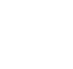
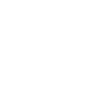

# Slackline-Tools

Slacklines, Slackline-Kits, Slackline Tools – https://www.slackline-tools.com/

## Logo

### Horizontal

 
`slackline-tools.svg`,
multicolored for light backgrounds,
dimensions 499×100

 
`slackline-tools--light.svg`,
multicolored for dark backgrounds,
dimensions 499×100

 
`slackline-tools--black.svg`,
single-colored black,
dimensions 499×100

 
`slackline-tools--white.svg`,
single-colored white,
dimensions 499×100

### Vertical

 
`slackline-tools--ver.svg`,
multicolored for light backgrounds,
dimensions 106×100

 
`slackline-tools--ver-light.svg`,
multicolored for dark backgrounds,
dimensions 106×100

 
`slackline-tools--ver-black.svg`,
single-colored black,
dimensions 106×100

 
`slackline-tools--ver-white.svg`,
single-colored white,
dimensions 106×100
